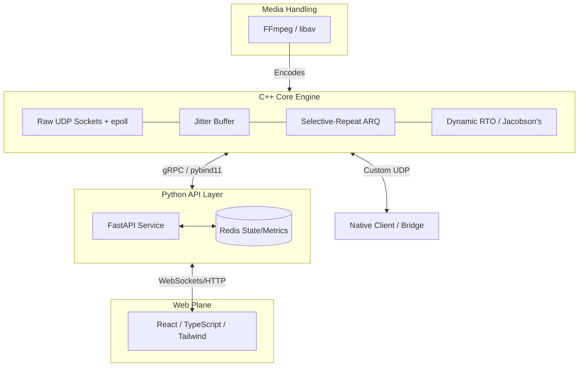

# SocketCast: Reliable-UDP Media Transport Protocol


A high-performance, custom reliable-UDP transport protocol engineered for real-time video streaming. 

Unlike standard streaming projects that rely on existing transport libraries (like WebRTC, gStreamer, or standard TCP), this project implements the transport layer from scratch. It features custom packet structures, selective-repeat ARQ, deadline-based retransmission, and congestion control to prioritize media delivery under volatile network conditions.

## System Architecture

The architecture is divided into decoupled layers, separating the high-performance network I/O from the control plane and frontend UI.



## Core Protocol Features

### 1. Deadline-Based Loss Recovery

Not all packets are created equal. The protocol calculates the exact time a lost packet is needed for playback. If the estimated Round Trip Time (RTT) for a NACK and retransmission exceeds the playback deadline, the packet is intentionally dropped to prevent latency cascading, relying on decoder concealment instead.

### 2. Selective-Repeat ARQ & Custom Headers

Implements a custom UDP packet header including sequence numbers, timestamps, and frame priority flags (Keyframe vs. P-frame). Uses NACK-based Selective-Repeat ARQ rather than naive Stop-and-Wait, allowing continuous data flow.

### 3. Dynamic RTO (Jacobson's Algorithm)

Timeout calculations are not hardcoded. The protocol continuously samples RTT and calculates variation, adapting the Retransmission Timeout (RTO) dynamically to match current network stability (similar to TCP's internal mechanics).

### 4. Adaptive Rate Control

Monitors sustained loss rates and RTT trends to detect network congestion before severe packet drop occurs. Signals the media layer to switch to lower bitrate tiers to maintain smooth playback.

## Tech Stack

* **Layer 1 (Transport & Networking):** C++, epoll / io_uring for async I/O, Raw UDP Sockets.
* **Layer 2 (Media):** FFmpeg / libav.
* **Layer 3 (Control Plane):** Python, FastAPI, Pybind11 (C++ bindings), Redis.
* **Layer 4 (Interface):** React, TypeScript, Tailwind CSS.
* **Layer 5 (Infrastructure):** Docker (Multi-stage builds), Kubernetes (Deployments, DaemonSets, UDP Load Balancing), Linux tc netem (for network simulation).

## Getting Started (Development)

Prerequisites: Docker, Docker Compose, C++17 compiler.

1. Clone the repository
```bash
git clone [https://github.com/kiarashbashokian/SocketCast.git](https://github.com/kiarashbashokian/SocketCast.git)
cd SocketCast

```


2. Build the C++ Engine and API Containers
```bash
docker-compose build

```


3. Run the stack
```bash
docker-compose up -d

```


4. Simulate Network Loss (Linux only)
Use tc (Traffic Control) to test the protocol's recovery mechanics:
```bash
# Introduce 5% packet loss and 50ms delay
sudo tc qdisc add dev lo root netem loss 5% delay 50ms

```


## Project Roadmap

* [ ] Phase 0: Protocol Specification (Header layouts, state machine, ACK/NACK definitions).
* [ ] Phase 1: Core C++ Engine (Raw UDP sockets, basic packet serialization).
* [ ] Phase 2: Reliability Layer (Jitter buffer, dynamic RTO, retransmission thresholds).
* [ ] Phase 3: Media Integration (FFmpeg chunking and encoding into custom packets).
* [ ] Phase 4: Python Control Plane (FastAPI integration, Redis session state).
* [ ] Phase 5: Kubernetes Deployment (UDP traffic routing, multi-node testing).
* [ ] Phase 6: Web Interface (React/TS dashboard bridged via WebSockets/WebTransport).

## Author

Kiarash Bashokian
