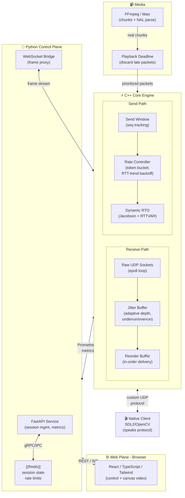

# SocketCast: Reliable-UDP Media Transport Protocol


> **Status:** 🧪 Final testing & hardening before deploy — Phases 0–6 complete and committed: protocol, transport, rate control, media integration, native client, Python control plane, and a live web dashboard streaming real H.264 video + AAC audio end-to-end over the custom UDP protocol. Phase 7 (observability) is mostly done — Prometheus/Grafana are live, engine-side metrics are the remaining gap. Phase 8 (DTLS, io_uring, fuzzing, Kubernetes) is what's left before a production deploy.

A custom reliable-UDP transport protocol designed and built from scratch for real-time video streaming.

Unlike streaming projects that wrap an existing transport (WebRTC, gStreamer, plain TCP), this project implements the transport layer itself: custom packet structures, selective-repeat ARQ, deadline-based retransmission, and congestion-aware rate control, purpose-built to prioritize media delivery under lossy, volatile network conditions.

## System Architecture

Decoupled layers separate the high-performance network I/O from the control plane and the web UI. Note the two distinct client paths—this split exists because **browsers cannot open raw UDP sockets**, so only the native client speaks the protocol directly; the browser is bridged via WebSocket.



### Architecture Notes

| Component | Purpose | Status |
|-----------|---------|--------|
| **Jitter Buffer** | Smooths out arrival-time variance via adaptive depth buffering | ✅ Phase 2 |
| **Rate Controller** | Token-bucket pacing + RTT-trend congestion backoff (BBR-inspired) | ✅ Phase 2 |
| **Dynamic RTO** | Jacobson's algorithm adapts retransmit timeout to current RTT | ✅ Phase 1 |
| **Selective-Repeat ARQ** | NACK-based retransmission keeps data flowing without stop-and-wait | ✅ Phase 1 |
| **Reorder Buffer** | In-order delivery despite out-of-order packet arrivals | ✅ Phase 1 |
| **Playback Deadline** | Computes max tolerable latency; discards packets that arrive too late | ✅ Phase 3 |
| **Real-time send pacing** | Sends media at its own source timeline instead of link-speed bursts | ✅ Phase 3 |
| **Native Client** | Speaks the protocol directly (no browser bridge); SDL2 playback, headless fallback | ✅ Phase 4 |
| **FastAPI Control Plane** | Session CRUD, metrics, WebSocket bridge (video+audio) to the browser, Redis-backed | ✅ Phase 5 |
| **Admin API** (engine) | HTTP control surface for starting/stopping streams, frame/audio polling, thread-per-connection | ✅ Phase 5 |
| **Web Dashboard** | React/TS/Tailwind UI — live canvas video (WebCodecs) + synced audio (Web Audio API), real-time metrics, dark/light theme | ✅ Phase 6 |
| **Observability** | Prometheus metrics + pre-provisioned Grafana dashboard | ✅ Phase 7 (control plane); 🚧 engine-side metrics still pending |
| **DTLS / io_uring / fuzzing / K8s** | Transport encryption, alternate event loop, parser fuzzing, cluster deploy | 🚧 Phase 8 |

**Key insight:** Phases 1–2 handle reliability and congestion. Phase 3 adds real media (FFmpeg chunks), deadline-aware drop logic, and real-time send pacing. Phase 4 adds the native protocol client. Phases 5–6 add the Python control plane and browser dashboard, bridged over WebSocket since browsers can't speak raw UDP. Phase 7 is partial observability; Phase 8 (security, performance, deploy hardening) is what's left before shipping.

## Core Protocol Features

*(Implemented and validated end-to-end in Phases 0–2; still the foundation everything above is built on.)*

### 1. Deadline-Based Loss Recovery
Not every packet is worth recovering. The protocol computes the exact time a lost packet is needed for playback; if the round trip needed for a NACK + retransmit would exceed that deadline, the packet is intentionally dropped in favor of decoder concealment, rather than retransmitting into a latency cascade.

### 2. Selective-Repeat ARQ & Custom Headers
A custom UDP packet header carries sequence numbers, timestamps, and frame-priority flags (keyframe vs. P-frame vs. audio). NACK-based selective-repeat ARQ keeps data flowing continuously, rather than naive stop-and-wait.

### 3. Dynamic RTO (Jacobson's Algorithm)
No hardcoded timeouts. RTT is sampled continuously and the retransmission timeout adapts to current network stability - the same mechanism TCP uses internally.

### 4. Adaptive Rate Control
Loss rate and RTT trend are monitored together to detect congestion *before* severe packet loss hits (a rising RTT signals a building queue), triggering an ABR downgrade to a lower bitrate tier to protect smoothness over resolution.

## Tech Stack

* **Layer 1 - Transport & Networking:** C++17, epoll (io_uring as a later, benchmarked port), raw UDP sockets.
* **Layer 2 - Media:** FFmpeg / libav, NAL-unit parsing for frame classification, concurrent AAC audio extraction.
* **Layer 3 - Control Plane:** Python, FastAPI, Redis, WebSocket bridge (binary video+audio frames with real PTS). C++/Python boundary is separate-process IPC (pybind11 is optional later).
* **Layer 4 - Interface:** React, TypeScript, Tailwind CSS, WebCodecs (`VideoDecoder`/`AudioDecoder`) for canvas playback, Web Audio API for synced audio output.
* **Layer 5 - Infrastructure:** Docker (multi-stage builds) with a full `docker-compose` stack (engine, control plane, dashboard, Redis, Prometheus, Grafana), Kubernetes (planned, Phase 8), `tc netem` for network-condition testing, libFuzzer for parser hardening (planned, Phase 8).

## Building from Source

**Prerequisites:** C++17 compiler, CMake 3.16+, ffmpeg (runtime dependency for media/audio extraction), Python 3.10+, Node 20+, optionally Docker & SDL2.

### Engine (C++ Transport & Streaming)

```bash
# Build with tests
cmake -S engine -B engine/build -DSOCKETCAST_BUILD_TESTS=ON
cmake --build engine/build
ctest --test-dir engine/build --output-on-failure   # 13 tests
```

### Native Client (C++ Playback)

```bash
# Builds with SDL2 if available (headless fallback if not)
cmake -S client -B client/build
cmake --build client/build
```

### Control Plane (Python / FastAPI)

```bash
cd control-plane
python -m venv venv && venv/bin/pip install -r requirements-dev.txt
venv/bin/python -m pytest -q            # 29 tests, mocked Redis — no live services needed
python -m uvicorn app.main:app          # needs a live Redis at REDIS_URL
```

### Dashboard (React / TypeScript)

```bash
cd dashboard
npm install
npm run build     # tsc -b && vite build
npm run lint
```

### Full Stack (Docker Compose)

The full demo stack — engine, control plane, dashboard, Redis, Prometheus, and Grafana — runs via `docker-compose.yml`:

```bash
docker compose up -d --build
```

Then, to stream a video into the running stack — the file must live under `Doc/dev/`, since that's the directory mounted into the engine container as `/media/`:

```bash
bash scripts/start_stream.sh Doc/dev/your-video.mp4
```

Open `http://localhost:5173`, enter `127.0.0.1` / `5000` in Session Control, and click **Connect** to watch. Starting a stream and viewing it are deliberately separate steps — Connect only opens the viewer, it does not start a stream.

After changing C++ code, rebuild just the engine image: `docker compose up -d --build engine`.

## Scripts & Demo Tools

All scripts are in `scripts/` and assume you're in the repo root.

### `start_stream.sh` — full-stack demo entry point

**Purpose:** Start a video stream into the running Docker stack for the web dashboard to display. This is the current, primary way to demo the whole system end-to-end (engine → control plane → dashboard, video + audio, real-time playback).

```bash
docker compose up -d --build          # start the full stack first
bash scripts/start_stream.sh [/path/to/video.mp4]   # defaults to a file under Doc/dev/
```

Open `http://localhost:5173`, connect to `127.0.0.1:5000`, then run the script — it waits for services, posts the stream request to the engine's admin API, and confirms packets are actually flowing before exiting (the stream keeps running in the engine independently of the script).

---

The remaining scripts below are lower-level engine tests from Phases 1–4 — still valid for exercising the transport in isolation, but the Docker + `start_stream.sh` flow above is the one to reach for when demoing or verifying the full product.

### `dev-setup.sh`
**Purpose:** Install development dependencies (CMake, build tools, optional SDL2).

```bash
./scripts/dev-setup.sh
```

---

### `phase1-loopback.sh`
**Purpose:** Test basic transport — send 100 dummy packets to localhost, verify ACK/NACK, measure no retransmits.

```bash
./scripts/phase1-loopback.sh
```

**Output:** Packet sequence, ACK count, retransmit count. All 100 should be delivered with 0 retransmits on clean network.

---

### `phase2-benchmark.sh`
**Purpose:** Validate rate control & jitter buffer under network conditions (loss, latency, jitter) using `tc netem`.

```bash
sudo ./scripts/phase2-benchmark.sh
```

**Runs:** 6 test scenarios:
- 0% loss, 0ms latency (baseline)
- 5% loss
- 10% loss
- 50ms latency
- 5% loss + 50ms latency
- 5% loss + 50ms latency + 10ms jitter

**Output:** ACK count and retransmit count for each scenario.

---

### `phase3-stream.sh`
**Purpose:** End-to-end media streaming — server encodes/streams H.264, listener writes received frames to file.

```bash
./scripts/phase3-stream.sh input.h264 [output.h264] [port]
```

**Examples:**
```bash
./scripts/phase3-stream.sh video.h264 received.h264 5000
./scripts/phase3-stream.sh video.mp4                      # ffmpeg auto-encodes
```

**Output:** Received file (Annex B H.264) if streaming succeeded.

---

### `phase4-demo.sh`
**Purpose:** Native client playback demo — stream from engine, client receives and displays.

```bash
./scripts/phase4-demo.sh input.h264 [port]
```

**Examples:**
```bash
./scripts/phase4-demo.sh video.h264 5000
```

**Output:** Client statistics (packets received, bitrate, frame count). With SDL2: video rendered in window.

---

### `netem-loss.sh` & `netem-reset.sh`
**Purpose:** Manually inject network conditions on loopback (Linux, requires root).

```bash
# Inject 5% loss, 50ms delay
sudo ./scripts/netem-loss.sh 5 50

# Run tests while active...

# Remove
sudo ./scripts/netem-reset.sh
```

---

## CLI Tools (Built Binaries)

### `engine/build/socketcast_engine`

**listen** — Start receiver

```bash
./engine/build/socketcast_engine listen [--bind ADDR] [--port N] [--output FILE.h264]
```

**send** — Send dummy packets

```bash
./engine/build/socketcast_engine send --host ADDR --port N [--count N] [--size N]
```

**stream** — Stream real video

```bash
./engine/build/socketcast_engine stream --host ADDR --port N --input FILE [--fps N]
```

### `client/build/socketcast_client`

**Connect to server and receive**

```bash
./client/build/socketcast_client SERVER [PORT]
```

Example:
```bash
./client/build/socketcast_client 127.0.0.1 5000
```

## Documentation

- **[Protocol Specification](Doc/protocol.md)** — Detailed v1 protocol: packet format, handshake, error recovery, rate control, jitter buffer, deadline-based drop logic, examples
- **[API Reference](Doc/api.md)** — C++ Engine API (Transport, Packet, Session, RateController, JitterBuffer, MediaSource/Sink) + Native Client API + CLI tools; FastAPI control-plane API
- **[Observability](Doc/OBSERVABILITY.md)** — Prometheus metrics surface, Grafana dashboard, structured logging

## License

MIT - see [LICENSE](LICENSE).

## Author

Kiarash Bashokian