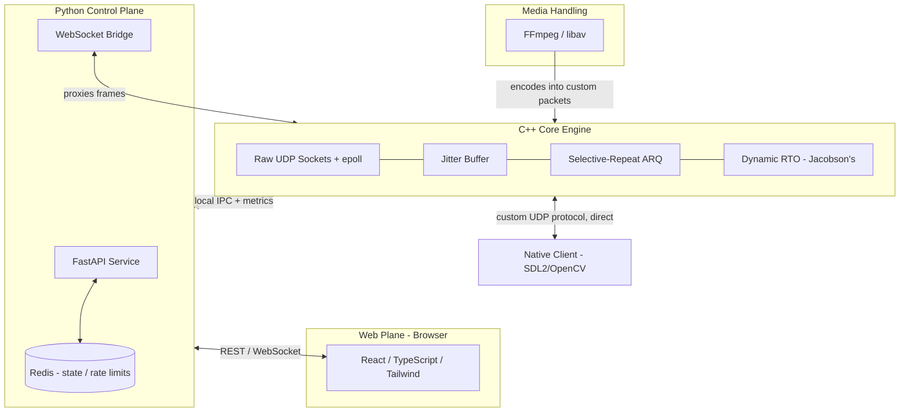

# SocketCast: Reliable-UDP Media Transport Protocol


> **Status:** 🚧  early development (Phases 0–1: spec frozen, dummy UDP+ACK/NACK works). Media path (Phases 3–4) is not done. This note comes down once the core transport (Phases 0–4) is working.

A custom reliable-UDP transport protocol designed and built from scratch for real-time video streaming.

Unlike streaming projects that wrap an existing transport (WebRTC, gStreamer, plain TCP), this project implements the transport layer itself: custom packet structures, selective-repeat ARQ, deadline-based retransmission, and congestion-aware rate control, purpose-built to prioritize media delivery under lossy, volatile network conditions.

## System Architecture

Decoupled layers separate the high-performance network I/O from the control plane and the web UI. Note the two distinct client paths - this split exists because **browsers cannot open raw UDP sockets**, so only the native client speaks the protocol directly; the browser is bridged.



## Core Protocol Features

*(Design targets for Phases 0–2.)*

### 1. Deadline-Based Loss Recovery
Not every packet is worth recovering. The protocol computes the exact time a lost packet is needed for playback; if the round trip needed for a NACK + retransmit would exceed that deadline, the packet is intentionally dropped in favor of decoder concealment, rather than retransmitting into a latency cascade.

### 2. Selective-Repeat ARQ & Custom Headers
A custom UDP packet header carries sequence numbers, timestamps, and frame-priority flags (keyframe vs. P-frame vs. audio). NACK-based selective-repeat ARQ keeps data flowing continuously, rather than naive stop-and-wait.

### 3. Dynamic RTO (Jacobson's Algorithm)
No hardcoded timeouts. RTT is sampled continuously and the retransmission timeout adapts to current network stability - the same mechanism TCP uses internally.

### 4. Adaptive Rate Control
Loss rate and RTT trend are monitored together to detect congestion *before* severe packet loss hits (a rising RTT signals a building queue), triggering an ABR downgrade to a lower bitrate tier to protect smoothness over resolution.

## Tech Stack

* **Layer 1 - Transport & Networking:** C++17, epoll (io_uring as a later, benchmarked port), raw UDP sockets.
* **Layer 2 - Media:** FFmpeg / libav, NAL-unit parsing for frame classification.
* **Layer 3 - Control Plane:** Python, FastAPI, Redis. C++/Python boundary is separate-process IPC (pybind11 is optional later).
* **Layer 4 - Interface:** React, TypeScript, Tailwind CSS.
* **Layer 5 - Infrastructure:** Docker (multi-stage builds), Kubernetes, `tc netem` for network-condition testing, libFuzzer for parser hardening.

## Getting Started (Development)

Prerequisites: Docker, Docker Compose, a C++17 compiler + CMake (for the native client, which is not containerized - see below).

```bash
git clone https://github.com/kiarashbashokian/SocketCast.git
cd SocketCast

# Build and run the engine, control-plane API, dashboard, and Redis
docker-compose build
docker-compose up -d
```

**Native client** (speaks the protocol directly - intentionally not dockerized, it's a GUI app):
```bash
cmake -S client -B client/build
cmake --build client/build
./client/build/socketcast_client
```

**Phase 1 dummy exchange** (two processes, no video):
```bash
cmake -S engine -B engine/build -DSOCKETCAST_BUILD_TESTS=ON
cmake --build engine/build
ctest --test-dir engine/build --output-on-failure

# or: listen in one terminal, send in another
./engine/build/socketcast_engine listen --bind 127.0.0.1 --port 5000
./engine/build/socketcast_engine send --host 127.0.0.1 --port 5000 --count 100
# equivalent: ./scripts/phase1-loopback.sh
```

**Simulate packet loss / latency** (Linux, requires root):
```bash
sudo ./scripts/netem-loss.sh 5 50   # 5% loss, 50ms delay
sudo ./scripts/netem-reset.sh       # remove
```

## Documentation

**🚧 to be complete**

## Project Roadmap

**Core (Phases 0–4)** - the transport protocol proven end-to-end:
- [x] Phase 0: Protocol specification (header layout, state machine, ACK/NACK, retransmit-deadline formula)
- [x] Phase 1: Bare C++ transport engine (epoll, raw UDP, basic ACK/NACK)
- [ ] Phase 2: Reliability & rate control (selective-repeat ARQ, jitter buffer, token-bucket + RTT-trend backoff)
- [ ] Phase 3: Media integration (FFmpeg chunking, NAL-unit frame classification)
- [ ] Phase 4: Native client (SDL2/OpenCV playback, speaks the protocol directly)

**Extended (Phases 5–8)** - production-shaped polish:
- [ ] Phase 5: Python control plane (FastAPI, Redis session state, WebSocket bridge)
- [ ] Phase 6: Web dashboard (React/TS/Tailwind, control plane + bridged video plane)
- [ ] Phase 7: Containerization & Kubernetes (UDP service routing, HPA)
- [ ] Phase 8: Hardening (Prometheus metrics, libFuzzer on the packet parser, DTLS, io_uring benchmark)

## License

MIT - see [LICENSE](LICENSE).

## Author

Kiarash Bashokian